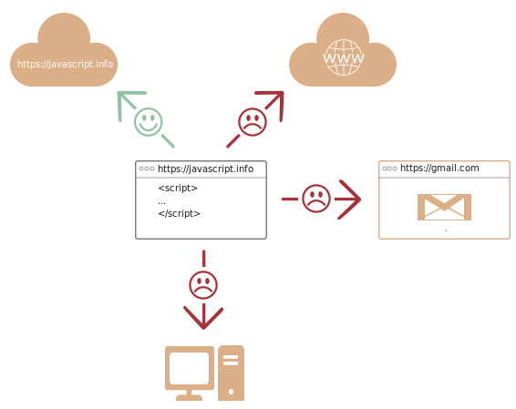

# Eine Einführung in JavaScript

Mal sehen was das Besondere an JavaScript ist, was wir damit alles anstellen können und welche anderen Technologien gut damit umgehen können.

## Was ist JavaScript?

JavaScript wurde ursprünglich entwickelt, um "Webseiten lebendig zu machen".

Die Programme dieser Sprache werden *scripts* genannt. Diese kann man direkt ins HTML einer Seite schreiben welche dann beim Laden der Seite automatisch ausgeführt werden.

Skripte werden als reiner Text bereitgestellt und ausgeführt. Sie benötigen keine spezielle Vorbereitung oder Kompilierung, um ausgeführt zu werden.

In diesem Aspekt unterscheidet sich JavaScript sehr von einer anderen Sprache namens [Java]https://de.wikipedia.org/wiki/Java_(Programmiersprache)).

```smart header="Warum heißt es <u>Java</u>Script?"
Als JavaScript entwickelt wurde, hatte es zunächst einen anderen Namen: "LiveScript". Aber Java war zu dieser Zeit sehr verbreitet, so dass beschlossen wurde, dass die Etablierung einer neuen Sprache als "kleiner Bruder" von Java helfen würde.

In der weiteren Entwicklung wurde JavaScript zu einer völlig unabhängigen Sprache mit einer eigenen Spezifikation, [ECMAScript](http://en.wikipedia.org/wiki/ECMAScript), und hat darum überhaupt keinen Bezug mehr zu Java.
```

Heute kann JavaScript nicht nur im Browser ausgeführt werden, sondern auch auf dem Server oder auf jedem Gerät, das über ein spezielles Programm namens [JavaScript engine](https://en.wikipedia.org/wiki/JavaScript_engine) verfügt.

Der Browser verfügt über eine eingebettete Engine, die manchmal auch als "JavaScript Virtual Machine" bezeichnet wird.

Verschiedene Engines haben unterschiedliche "Codenamen". Zum Beispiel:

- [V8](https://de.wikipedia.org/wiki/V8_(JavaScript-Implementierung)) -- in Chrome und Opera.
- [SpiderMonkey](https://de.wikipedia.org/wiki/SpiderMonkey) -- in Firefox.
- Es gibt noch weitere *codenames*, sprich Engines, wie "Trident" und "Chakra" für verschiedene Versionen von IE, oder "ChakraCore" für Microsoft Edge, "Nitro" und "SquirrelFish" für Safari usw.

Die oben genannten Begriffe sollte man sich merken, weil sie in Entwicklerarikeln im Internet verwendet werden. Wir werden sie auch verwenden. Wenn, zum Beispiel, "ein Feature X von V8 unterstützt wird", dann funktioniert es wahrscheinlich in Chrome und Opera.

```smart header="Wie funktionieren Engines?"

Engines sind kompliziert. Aber die Grundlagen sind einfach.

1. Die Engine (eingebettet, wenn es sich um einen Browser handelt) liest ("parst") das Script.
2. Danach wird das Script in Maschinensprache konvertiert ("kompiliert").
3. Und zum Schluss wird der Maschienencode ausgeführt, was ziemlich schnell passiert.

Die Engine wendet in jedem Schritt des Prozesses Optimierungen an. Es beobachtet sogar das kompilierte Skript während es läuft, analysiert die Daten, welche sie verarbeitet, und optimiert den Maschinencode basierend auf diesem Wissen weiter.
```

## Was kann im Browser ausgeführtes JavaScript?

Modernes JavaScript ist eine "sichere" Programmiersprache. Es bietet keinen Low-Level-Zugriff auf Speicher oder CPU, da es ursprünglich für Browser entwickelt wurde, die dies nicht benötigen.

Die Funktionen von JavaScript hängen stark von der Umgebung ab in der es ausgeführt wird. Beispielsweise unterstützt [Node.js](https://wikipedia.org/wiki/Node.js) Funktionen die es JavaScript z. B. ermöglichen beliebige Dateien zu lesen oder zu schreiben, sowie Netzwerkanfragen durchzuführen.

Im Browser ausgeführtes JavaScript kann alles was mit der Manipulation von Webseiten, der Interaktion mit dem Benutzer und dem Webserver zu tun hat.

So ist beispielsweise im Browser laufendes JavaScript in der Lage:

- Der Seite neues HTML hinzuzufügen, den existierenden Inhalt zu modifizieren oder Stile anzupassen.
- Auf Benutzeraktionen zu reagieren, zum Beispiel Mausklicks, Mauszeigerbewegungen oder Tastenanschläge.
- Anfragen über das Netzwerk an Remote-Server senden, Herunter- und Hochladen von Dateien (sogenannte [AJAX](https://de.wikipedia.org/wiki/Ajax_(Programmierung))- und [COMET](https://en.wikipedia.org/wiki/Comet_(programming))- Technologien).
- Cookies auslesen und setzen, Fragen an den Besucher stellen, Nachrichten anzeigen.
- Daten auf der *client-side* zu speichern ("lokaler Speicher"). Also im Browser des Benutzers.

## Was kann JavaScript im Browser nicht tun?

Die Fähigkeiten von JavaScript im Browser sind aus Gründen der Sicherheit des Benutzers eingeschränkt. Ziel ist es zu verhindern, dass eine bösartige Webseite auf private Informationen zugreifen oder die Daten des Benutzers schädigen kann.

Beispiele für solche Beschränkungen sind:

- JavaScript auf einer Webseite darf keine willkürlichen Dateien auf der Festplatte lesen, schreiben oder kopieren, oder Programme ausführen. Es hat keinen direkten Zugriff auf die Funktionen des Betriebssystems.

    Moderne Browsers erlauben es mit Dateien zu arbeiten. Der Zugriff ist jedoch beschränkt und nur möglich wenn der Benutzer bestimmte Aktionen ausführt, z. B. eine Datei in den Browser per "drag and drop" lädt oder sie via ein `<input>` tag auswählt.

    Es gibt Möglichkeiten, mit Kamera/Mikrofon und anderen Geräten zu interagieren, aber sie erfordern die ausdrückliche Genehmigung des Benutzers. JavaScript auf einer Webseite darf also nicht heimlich eine Webcam aktivieren, die Umgebung beobachten und die Informationen an die [NSA](https://de.wikipedia.org/wiki/National_Security_Agency) senden.
- Verschiedene *Tabs*/Fenster wissen in der Regel nicht voneinander. Es gibt jedoch Ausnahmen bei welchen dies doch der Fall sein kann. Z. B. dann wenn durch JavaScript ein neues Fenster geöffnet wird. Aber selbst in einem solchen Fall kann das auf der einen Seite laufende JavaScript nicht unbedingt auf die andere Seite zugreifen, sofern diese verschiedenen Ursprungs sind (unterschiedlichen Domänen entspringen, ein anderes Protokoll oder anderen Port haben).

    Das nennt man "Same Origin Policy". Um so etwas zu erreichen muss auf *beiden Seiten* ein Datenaustausch akzeptiert werden. Zudem müssen beide Seiten über einen speziellen JavaScript-Code verfügen der das händeln kann. Wir werden das im Tutorial behandeln.

    Auch diese Einschränkung dient der Sicherheit des Benutzers. Eine Seite von `http://anysite.com`, die ein Benutzer geöffnet hat, darf nicht in der Lage sein auf ein anderes Browser-Tab mit der URL `http://gmail.com` zuzugreifen und Informationen von dort zu stehlen.
- JavaScript kann mit Leichtigkeit über das Netz mit dem Server kommunizieren von dem die aktuelle Seite abgerufen wurde. Aber seine Fähigkeit Daten von anderen Seiten/Domains zu empfangen ist eingeschränkt. 
Auch wenn es möglich ist erfordert es eine ausdrückliche Zustimmung (ausgedrückt in *HTTP-Headern*) von der anderen Seite. Auch dies ist eine sicherheitsbedingte Einschränkung.



Solche Einschränkungen bestehen nicht wenn JavaScript außerhalb des Browsers, z. B. auf einem Server, ausgeführt wird. Moderne Browser erlauben auch Plugins/Erweiterungen, die unter Umständen nach erweiterten Rechten fragen.

## Was macht JavaScript einzigartig?

Es gibt mindestens *drei* großartige Dinge welche JavaScript auszeichnen:

```compare
+ Volle Integration in HTML und CSS.
+ Einfache Dinge werden einfach gemacht.
+ Unterstützung von allen gängigen Browsern die JavaScript standardmäßig aktiviert haben.
```
JavaScript ist die einzige Browser-Technologie, die diese drei Dinge vereint.

Das macht JavaScript einzigartig. Deshalb ist es das am weitesten verbreitete Werkzeug zur Erstellung von Browser-Oberflächen.

Außerdem können mit JavaScript auch Server, mobile Anwendungen, usw. erstellt werden.

## Sprachen "über" JavaScript

Die Syntax von JavaScript entspricht nicht jedem. Verschiedene Individuen bevorzugen verschiedene Funktionen.

Das ist zu erwarten, denn Projekte und Anforderungen sind für jeden anders.

So haben sich vor kurzem eine Fülle neuer Sprachen entwickelt, die in JavaScript *transpiled* (konvertiert) werden, bevor sie im Browser laufen.

Moderne Werkzeuge erledigen die Konvertierung sehr schnell und transparent was es Entwicklern erlaubt in einer anderen Sprache zu programmieren und diese automatisch zu konvertieren – ohne unbedingt ein genaueres Verständnis davon zu haben wie JavaScript im Kern funktioniert.

Beispiele für solche Sprachen sind:

- [CoffeeScript](http://coffeescript.org/): Es verfügt über eine kürzere Syntax was einen erlaubt klareren und präziseren Code zu schreiben. *Ruby devs* fungiert auf ähnliche Art und Weiße.
- [TypeScript](http://www.typescriptlang.org/) konzentriert sich auf das Hinzufügen einer "strengen Datentypisierung", um die Entwicklung und Unterstützung komplexer Systeme zu vereinfachen. Es wird von Microsoft entwickelt.
- [Flow](http://flow.org/) fügt auch die Datentypisierung hinzu, jedoch auf andere Art und Weise. Entwickelt von Facebook.
- [Dart](https://www.dartlang.org/) ist eine eigenständige Sprache, die eine eigene Engine besitzt, die in Nicht-Browser-Umgebungen (wie mobilen Anwendungen) läuft, aber auch in JavaScript transponiert werden kann. Entwickelt von Google.

Es gibt noch mehr. Natürlich sollten wir, selbst wenn wir eine der transponierten Sprachen verwenden, auch JavaScript beherrschen, um zu verstehen, was wir tun.

## Zusammenfassung

- JavaScript wurde ursprünglich als reine Browser-Sprache entwickelt, wird aber mittlerweile auch in vielen anderen Umgebungen eingesetzt.
- Heute hat JavaScript eine einzigartige Position als die am weitesten verbreitete Browsersprache mit voller Integration in HTML/CSS.
- Es gibt viele Sprachen, die in JavaScript "transponiert" werden und bestimmte Funktionen bieten. Es wird empfohlen, sich diese zumindest kurz anzuschauen, nachdem du JavaScript beherrscht.
