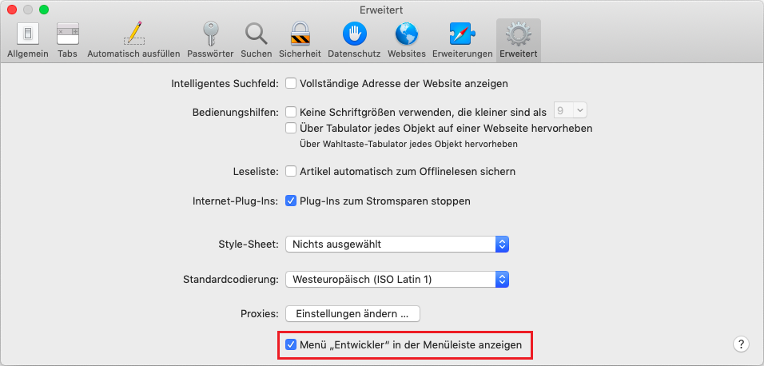

# Entwickler-Konsole

Code ist anfällig für Fehler. Du wirst sehr wahrscheinlich Fehler machen... Oh, was rede ich da? Du wirst *auf jeden Fall* Fehler machen, zumindest wenn du ein Mensch bist und kein [Roboter](https://en.wikipedia.org/wiki/Bender_(Futurama)).

Aber im Browser sehen die Benutzer standardmäßig keine Fehler. Wenn also im Skript etwas schief geht, sehen wir nicht, was fehlerhaft ist und können es nicht beheben.

Um Fehler zu sehen und weitere nützliche Informationen über Skripte zu erhalten, wurden "Entwicklerwerkzeuge" in die Browser eingebettet.

Die meisten Entwickler tendieren bei der Entwicklung zu Chrome oder Firefox, da diese Browser über die besten Entwicklerwerkzeuge verfügen. Andere Browser bieten ebenfalls Entwicklerwerkzeuge an, manchmal mit speziellen Funktionen, aber in der Regel lassen Chrome oder Firefox diese hinter sich. So haben die meisten Entwickler einen "Lieblingsbrowser" und wechseln zu einen anderen, wenn es ein browserspezifisches Problem gibt.

Entwicklerwerkzeuge sind leistungsstark; sie haben viele Funktionen. Zu Beginn werden wir lernen, wie man sie öffnet, Fehler betrachtet und JavaScript-Befehle ausführt.

## Google Chrome

Öffne die Seite [bug.html](bug.html).

Dort ist ein Fehler im JavaScript-Code. Er ist aus Sicht eines normalen Besuchers nicht zu sehen, also öffnen wird die Entwicklerwerkzeuge um ihn zu sehen.

Drücke `key:F12` oder wenn du auf einem Mac bist `key:Cmd+Opt+J`.

Die Entwicklertools öffnen sich standardmäßig auf dem Konsolen-Reiter.

Es sieht ungefähr so aus:


Wie genau die Entwicklertools aussehen, hängt von der Chrome-Version ab. Sie ändern sich von Zeit zu Zeit, aber sollten ähnlich aussehen.

- Hier sehen wir die rot markierte Fehlermeldung. In diesem Fall beinhaltet das Skript einen unbekannten Befehl "lalala".
- Auf der rechten Seite ist ein anklickbarer Link zur Quelle `bug.html:12` mit der Zeilennummer, wo der Fehler aufgetreten ist.

Unter der Fehlermeldung befindet sich ein blaues `>` Symbol. Es markiert eine "Befehlszeile" wo wir JavaScript-Befehle eingeben können. Drücke `key:Enter` um sie auszuführen.

Nun können wir Fehler sehen und das ist genug für den Anfang. Wir kehren späte zu den Entwicklertoos zurück und behandeln das Debugging im Kapitel <info:debugging-chrome> tiefer.

```smart header="Multi-line input"
Normalerweise, wenn wir eine Zeile Code in die Konsole eingeben und dann `key:Enter` drücken, wird er ausgeführt.

Um mehrere Zeilen einzugeben, drücke `key:Shift+Enter`. Auf diese Weise können längere Fragmente JavaScript-Code eingegeben werden.
```

## Firefox, Edge, und andere

Die meisten Browser benutzen `key:F12` um die Entwicklertools zu öffnen.

Das Aussehen ist meist sehr ähnlich. Sobald du weißt wie man eins dieser Tools benutzt (du kannst mit Chrome anfangen), kannst du einfach zu einem anderen wechseln.

## Safari

Safari (Mac Browser, nicht unterstützt werden Windows/Linux) ist etwas speziell. Wir müssen zuerst das "Entwickler-Menü" aktivieren.

Öffne Einstellungen und wähle "Erweitert" aus. Dort ist unten ein Kontrollkästchen:



Nun kann `key:Cmd+Opt+C` die Konsole umschalten. Beachte ebenfalls den neuen Menüeintrag "Entwickler", der aufgetaucht ist. Dieser hat viele Befehle und Optionen.

## Zusammenfassung

- Entwicklertools ermöglichen uns Fehler zu sehen, Befehle auszuführen, Variablen zu untersuchen und vieles mehr
- Sie können mit `key:F12` in den meisten Browsern auf Windows geöffnet werden. Chrome für den Mac benötigt `key:Cmd+Opt+J`, Safari: `key:Cmd+Opt+C` (muss erst eingeschaltet werden).

Nun ist unsere Umgebung bereit. Im nächsten Abschnitt kommen wir zu JavaScript.
