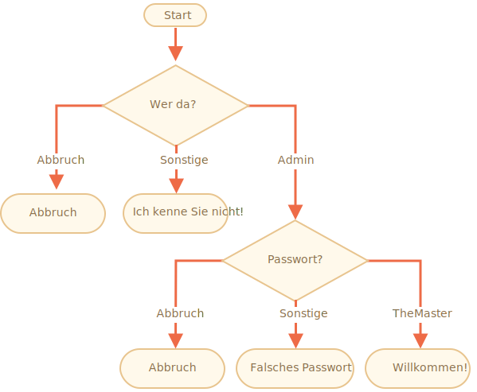

importance: 3

---

# Login-Prüfung

Schreibe Code der mit `prompt` nach Anmeldedaten fragt.

Gibt der Benutzer `"Admin"` ein, dann frage per `prompt` nach einem Passwort, ist die Eingabe eine Leerzeile oder `key:Esc` -- gib "Abbruch" aus, ist sie eine andere Zeichenkette -- dann gib aus "Ich kenne Sie nicht!".

Das Passwort wird wie folgt geprüft:

- Ist es "TheMaster", dann antworte mit "Willkommen!",
- Reagiere auf jede andere nicht-leere Zeichenkette mit der Anzeige -- "Falsches Passwort",
- Bei leerer Eingabzeile oder abgebrichener Eingabe zeige "Abbruch" an.

Als Struktogramm:

Verwende eingerückte `if`-Blöcke und beachte die allgemeine Lesbarkeit des Codes.

Hinweis (Eingabeaufforderung):  Eine leere Eingabe liefert die leere Zeichenkette `''`. Wird die Taste `key:ESC` betätigt, ist der Rückgabewert `null`.

[demo]
