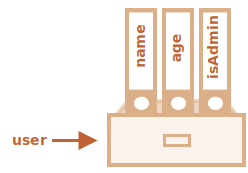

# Objekte

Wie wir vom Kapitel <info:types> bereits wissen, gibt es acht Datentypen in JavaScript. Sieben von diesen nennen sich “primitiv”, weil ihre Werte nur eine einzige Sache beinhalten (sei dies eine Zeichenkette, eine Nummer oder was auch immer). 

Im Gegenzug werden Objekte dazu benutzt, um verschlüsselte Sammlungen mit verschiedenen Daten und weit aus mehr komplexere Entitäten abzuspeichern. In JavaScript berühren Objekte fast jeden Aspekt der Sprache, weshalb wir sie verstehen müssen bevor wir irgendwo sonst in die Tiefe gehen. 

Ein Objekt kann mit geschweiften Klammern `{…}` mit einer optionalen Liste an *Properties* erstellt werden. Eine Property ist ein “Schlüssel: Wert” Paar, wobei `key` eine Zeichenkette ist (auch “property name” genannt) und `value` alles sein kann. 

Wir können uns ein Objekt als einen Schrank mit beschriebenen Ordnern vorstellen. Jedes Datenstück wird durch den Schlüssel in seinem Ordner gespeichert. Es ist leicht ein Ordner durch seinen Namen zu finden oder einen Ordner hinzuzufügen oder zu entfernen. 


Ein leeres Objekt (“leerer Schrank”) kann mit einer der zwei Syntaxen erstellt werden: 

```js
let user = new Object(); // “object constructor” syntax
let user = {};  // “object literal” syntax
```


Üblicherweise werden die geschweiften Klammern `{...}` genutzt. Diese Deklaration nennt sich *object literal*.

## Literals and properties

Wir können umgehend einige Properties innerhalb die `{...}` mit “Schlüssel: Wert” Paare setzen:

```js
let user = {     // ein Objekt
  name: “John”,  // mit Schlüssel “name” speichere Wert “John”
  age: 30        // mit Schlüssel “age” speichere Wert 30
};
```

Eine Property hat einen Schlüssel (auch bekannt als “name” oder “identifier”) vor dem Semikolon `”:”` und einen Wert rechts davon. 

Im Objekt `user` gibt es zwei Properties: 

1. Die erste Property hat den Namen `”name”` und den Wert `”John”`.
2. Die zweite hat den Namen `”age”` und den Wert `30`.

Das resultierende Objekt `user` kann man sich als einen Schrank mit zwei beschriebenen Ordnern vorstellen, die mit “name” und “age” beschriftet sind. 


Wir können jederzeit Ordner hinzufügen, entfernen und lesen. 

Auf die Property-Werte kann man mit der Punkt-Notation zugreifen: 

```js
// erhalte Property-Werte des Objekts:
alert( user.name ); // John
alert( user.age ); // 30
```
Der Wert kann von jedem Typ sein. Hier fügen wir einen boolischen hinzu: 

```js
user.isAdmin = true;
```



Um eine Property zu entfernen, können wir den `delete` Operator benutzen: 

```js
delete user.age;
```


Wir können auch mehrwortige Property-Namen nutzen, jedoch müssen diese zwischen Anführungszeichen stehen: 

```js
let user = {
  name: “John”,
  age: 30,
  “likes birds”: true  // mehrwortige Property-Namen 
                       // müssen zwischen Anführungszeichen stehen
};
```


Die letzte Property in der Liste sollte mit einem Komma enden: 
```js
let user = {
  name: “John”,
  age: 30*!*,*/!*
}
```
Dies nennt sich ein “anhängendes” oder “hängendes” Komma. Das vereinfacht es um Propertiers hinzuzufügen/entfernen/bewegen, da alle Linien sich gleichen.  

## Eckige Klammern

Bei mehrwortigen Properties funktioniert die Punkt-Notierung nicht: 

```js run
// dies würde einen Syntaxerror ergeben
user.likes birds = true
```

JavaScript versteht das nicht. Es meint wir adressieren `user.likes`, was dann einen Syntaxfehler ergibt, wenn es auf das unerwartete `birds` trifft. 

Der Punkt verlangt vom Schlüssel eine valide Variabelkennung zu sein. Das impliziert, dass diese keine Abstände besitzt, mit keiner Ziffer beginnt und keine Spezialcharakter enthält (`$` und `_` sind erlaubt).

Es gibt eine alternative “Eckige Klammer-Notation” die mit jeder Zeichenkette funktioniert: 

```js run
let user = {};

// set
user[“likes birds”] = true;

// get
alert(user[“likes birds”]); // true

// delete
delete user[“likes birds”];
```

Jetzt ist alles gut. Man beachte, dass der String innerhalb der eckigen Klammern passend zitiert ist (jeder Typ von Anführungszeichen ist passend). 

Eckige Klammern bieten auch eine Möglichkeit, mit der der Property-Name das Resultat einer Expression wird -- im Gegensatz zu einem lieteral String -- wie von einer Variabel, wie folgend gezeigt wird: 

```js
let key = “likes birds”;

// das selbe wie[“likes birds”] = true;
user[key] = true;
```
Hier wird die Variabel `key` möglicherweise während der Laufzeit des Skript kalkuliert oder ist abhängig von der Eingabe des Nutzers. Und dann nutzen wird diese um auf die Property zuzugreifen. 
Das gibt uns eine große Flexibilität. 

Zum Beispiel:

```js run
let user = {
  name: “John”,
  age: 30
};

let key = prompt(“What do you want to know about the user?”, “name”);

// zugriff durch die Variabel 
alert( user[key] ); // John (wenn “name” eingegeben)
```

Die Punkt-Notation kann in ähnlicher Weise nicht genutzt werden:

```js run
let user = {
  name: “John”,
  age: 30
};

let key = “name”;
alert( user.key ) // undefined
```

### Berechnete Properties

Wir können eckige Klammern in einem literal Objekt benutzen. Das nennt sich ...

Zum Beispiel:

```js run
let fruit = prompt(“Which fruit to buy?”, “apple”);

let bag = {
*!*
  [fruit]: 5, // der Name der Property kommt von der Variabel fruit
*/!*
};

alert( bag.apple ); // 5 wenn fruit=”apple”
```

Die Bedeutung einer berechneten Property ist einfach: `[fruit]` bedeutet, dass der Property-Name von `fruit` genutzt werden soll. 

Wenn ein Besucher also `”apple”` eingibt, wird `bag` zu `{apple:5}` werden. 

Im Grunde funktioniert das genauso wie: 
```js run
let fruit = prompt(“Which fruit to buy?”, “apple”);
let bag = {};

// nehme den Property-Name von der fruit Variabel
bag[fruit] = 5;
```

... sieht aber besser aus.

Wir können weit komplexere Expressionen innerhalb von eckigen Klammern nutzen: 

```js
let fruit = ‘apple’;
let bag = {
  [fruit + ‘Computers’]: 5 // bag.appleComputers = 5
};
```

Eckige Klammern bemächtigen um einiges mehr als die Punkt-Notation. Sie erlauben uns jegliche Property-Namen und Variabeln. Jedoch sind sie auch umständlicher zu schreiben. 

Deshalb wird in den meisten Fällen, sofern die Property-Namen bekannt und einfach sind, die Punkt-Notation genutzt. Und wenn wir etwas komplexeres benötigen, dann wechseln wir zu den eckigen Klammern. 

## Property-Werte Kurzschrift 

In realen Code benutzen wir oft bereits existierende Variabeln als Werte für Property-Namen. 

Zum Beispiel:

```js run
function makeUser(name, age) {
  return {
    name: name,
    age: age,
    // ...other properties
  };
}

let user = makeUser(“John”, 30);
alert(user.name); // John
```

Im obigen Beispiel haben Properties den selben Namen wie Variabeln. Der Anwendungsfall, aus einer Variabel eine Property zu machen ist so üblich, dass es einen speziellen *Property-Werte Kurzschrift* gibt um dies zu verkürzen. 

Anstelle von `name:name`, können wir `name` wie folgt schreiben:

```js
function makeUser(name, age) {
*!*
  return {
    name, // das selbe wie name: name
    age,  // das selbe wie age: age
    // ...
  };
*/!*
}
```

Wir können zugleich die normalen Properties und die Kurzschrift im selben Objekt nutzen: 

```js
let user = {
  name,  // das selbe wie name:name
  age: 30
};
```

## Property names limitations

Property-Namen (keys) müssen entweder Strings sein oder Symbole (ein spezieller Typ für Kennungen, der später behandelt wird). 

Andere Typen werden automatisch zu Strings konvertiert. 

Beispielsweise wird eine Nummer `0`, die als Property-Schlüssel genutzt wird, zu dem String `”0”`: 

```js run
let obj = {
  0: “test” // same as “0”: “test”
};

// both alerts access the same property (the number 0 is converted to string “0”)
alert( obj[“0”] ); // test
alert( obj[0] ); // test (same property)
```

**Besetzte Wörter sind als Property-Namen zugelassen.**

Wie wir bereits wissen kann eine Variabel nicht den selben Namen haben, der gleich ist mit einer der reservierten Wörter der Sprache wie “for”, “let”, “return” etc. 

Aber bei einer Property eines Objekt gibt es keine solche Restriktionen. Jeglicher Name kann genutzt werden: 

```js run
let obj = {
  for: 1,
  let: 2,
  return: 3
};

alert( obj.for + obj.let + obj.return );  // 6
```

Wir können jeden String als einen Schlüssel nuten, aber es gibt eine spezielle Property namens `__proto__`, die eine spezielle Behandlung aus historischen Gründen erhält. 

Zum Beispiel ist es nicht möglich, diesen einen anderen als den Objektewert zuzuweisen: 

```js run
let obj = {};
obj.__proto__ = 5; // eine Nummer zuweisen 
alert(obj.__proto__); // [object Object] - der Wert ist ein Objekt, es funktionierte nicht wie geplant
```

Wie vom Code ersichtlich, wird die Zuordnung zum Primitive `5` ignoriert. 

Die `__proto__` zugrunde liegende Natur wird im Detail im späteren Kapitel [](info:prototype-inheritance) aufgelöst. 

Für jetzt reicht es aus zu wissen, dass diese Verhalten von `__proto__` eine Fehlerquelle für Bugs und selbst Angreifbarkeiten werden kann, wenn wir vorsehen vom Nutzer gegebene Schlüssel in einem Objekt zu speichern. 

Das Problem liegt darin, dass ein Besucher eventuell `__proto__` als Schlüssel nutzt und die Zuordnungslogik damit ruiniert wird (wie oben gezeigt). 

Es gibt zwei Möglichkeiten das Problem zu umgehen: 
1. Modifiziere das Verhalten des Objekt so, dass dieses `__proto__` als reguläre Property behandelt. Wir lernen wie das geht in dem Kapitel [](info:prototype-methods).
2. Man nutzt die Datenstruktur von [Map](info:map-set), die willkürliche Schlüssel annimmt. Wir lernen darüber in dem Kapitel <info:map-set>.

## Property-Existenstest, "in" Operator

Eine besondere Eigenschaft des Objekt ist es, dass es möglich ist auf jede Property zuzugreifen. Es wird keinen Fehler geben, wenn die Property nicht existiert! Beim Zugriff auf eine nicht existierende Property wird `undefined` ausgegeben. Das liefert ein übliches Verfahren mit dem getestet werden kann ob eine Property existiert -- sie abzurufen und mit undefined zu vergleichen: 

```js run
let user = {};

alert( user.noSuchProperty === undefined ); // true bedeuted “keine solche Property”
```

Es existiert auch ein spezieller Operator `”in”`, um die Existenz einer Property zu überprüfen. 

Der Syntax ist:
```js
“key” in object
```

Zum Beispiel:

```js run
let user = { name: “John”, age: 30 };

alert( “age” in user ); // true, user.age exists
alert( “blabla” in user ); // false, user.blabla doesn’t exist
```

Man beachte, dass auf der linken Seite von `in` immer ein *property-Name* stehen muss. Das ist für üblich ein zwischen Anführungszeichen stehender String. 

Wenn wir Anführungszeichen vergessen würde das bedeuten, dass eine Variabel die den eigentlichen Namen beinhaltet getestet wird. Zum Beispiel: 

```js run
let user = { age: 30 };

let key = “age”;
alert( *!*key*/!* in user ); // wahr, nimmt den Namen vom Schlüssel und prüft nach einer solchen Property
```

````smart header=”Nutzung von \”in\” bei Properties die `undefined` speichern”
Normalerweise prüft der strike Vergleich `”=== undefined”` die Existens der Property und das würde damit genügen. Aber is gibt einen speziellen Fall, wenn dies fehlschlägt, aber `"in"` funktioniert korrekt. 

Es kommt vor, wenn eine Property im Objekt exisitert die `undefined` speichert:

```js run
let obj = {
  test: undefined
};

alert( obj.test ); // es ist undefined - also keine solche Property?

alert( “test” in obj ); // wahr, die Property existiert!
```

Im obigen Code existiert die Property `obj.test` aus technischer Sicht. Deshalb funktioniert der Operator `in` richtig. 

Situationen wie diese kommen seltenst vor, da `undefined` normalerweise nicht zugewiesen wird. Man nutzt meistens `null` für “unbekannte” oder “leere” Werte. Darum ist der `in` Operator ein außergewöhnlicher Gast im Code. 

## Die “for..in” Schleife

Um alle Schlüssel eines Objekt zu übersehen gibt es eine spezielle Form der Schleife: `for..in`. Dies ist eine komplett andere Sache als das `for(;;)` Konstrukt das wir zuvor studiert hatten. 

Der Syntax: 

```js
for (key in object) {
  // führt den Körper für jeden Schlüssel innerhalb eines Objekt aus
}
```

Im folgenden werden alle Properties von `user` ausgegeben:

```js run
let user = {
  name: “John”,
  age: 30,
  isAdmin: true
};

for (let key in user) {
  // keys
  alert( key );  // name, age, isAdmin
  // values for the keys
  alert( user[key] ); // John, 30, true
}
```

Man beachte, dass alle “for” Konstrukte es uns erlauben die Schleifenvariabel innerhalb der Schleife zu deklarieren, wie `let key` hier. 

Das heißt wir könnten auch einen anderen Variabelnamen als `key` nutzen. Zum Beispiel wird `”for (let prop in obj)”` auch weitläufig genutzt. 


### Geordnet wie ein Objekt 

Sind Objekte geordnet? In anderen Worten, wenn wir ein Objekt loopen, bekommen wir dann alle Properties in der selben Reihenfolge wie wir diese hinzugefügt haben? Können wir uns darauf verlassen? 

Die kurze Antwortet lautet: “geordnet auf eine spezielle Art und Weise”: ganzzahlige Properties sind geordnet, andere erscheinen in der Reihenfolge in der sie kreiert wurden. Die Details folgen. 

Man nehme als ein Beispiel ein Objekt mit Ländervorwahlen:

```js run
let codes = {
  “49”: “Germany”,
  “41”: “Switzerland”,
  “44”: “Great Britain”,
  // ..,
  “1”: “USA”
};

*!*
for (let code in codes) {
  alert(code); // 1, 41, 44, 49
}
*/!*
```

Das Objekt soll möglicherweise genutzt werden um den Nutzer eine Liste an Optionen vorzuschlagen. Wenn wir eine Seite für eine überwiegend deutsche Audienz schaffen, dann wollen wir womöglich `49` an erster Stelle.

Aber wenn wir den Code laufen lassen, dann sehen wir ein total anderes Bild: 

- Die USA (1) kommen zuerst 
- dann die Schweiz (41) und so weiter. 

Die Ländervorwahlen werden aufwärts gehend sortiert, da sie ganze Zahlen sind. Deshalb sehen wir `1, 41, 44, 49`.

````smart header=”Ganzzahlige Properties? Was ist das?”
Der Term “ganzzahlige Property” meint hier einen String, der von und zu einer ganzen Zahl konvertiert werden kann ohne eine Veränderung. 

Deshalb ist “49” ein ganzzahliger Property-Name, da dieser, wenn er zu einer ganzen Zahl und zurück transformiert wird, immer noch der selbe ist. “+49” und “1.2” hingegen nicht: 

```js run
// Math.trunc ist eine eingebaute Funktion, die den Dezimalteil entfernt
alert( String(Math.trunc(Number(“49”))) ); // “49”, gleich, ganzzahlige Property
alert( String(Math.trunc(Number(“+49”))) ); // “49”, nicht gleich “+49” ⇒ keine ganzzahlige Property
alert( String(Math.trunc(Number(“1.2”))) ); // “1”, nicht gleich “1.2” ⇒ keine ganzzahlige Property
```
````

... auf der anderen Seite, wenn die Schlüssel keine ganzen Zahlen sind, dann werden diese in der Reihenfolge geordnet in der sie geschaffen wurden. Zum Beispiel: 

```js run
let user = {
  name: “John”,
  surname: “Smith”
};
user.age = 25; // einen weiteren hinzufügen 

*!*
// nicht ganzzahlige Properties sind in der Reihenfolge der Kreation
*/!*
for (let prop in user) {
  alert( prop ); // name, surname, age
}
```

Um das Problem mit den Ländervorwahlen zu beheben, können wir “cheaten”, indem wir the Vorwahlen nicht ganzzahlig machen. Ein Pluszeichen “+” vor jeder Vorwahl genügt. 

Wie hier:

```js run
let codes = {
  “+49”: “Germany”,
  “+41”: “Switzerland”,
  “+44”: “Great Britain”,
  // ..,
  “+1”: “USA”
};

for (let code in codes) {
  alert( +code ); // 49, 41, 44, 1
}
```

Jetzt funktioniert es wie beabsichtigt. 

## Kopieren per Referenz

Eine der fundamentalen Unterschiede von Objekte gegenüber Primitven ist, dass diese “referenziell” gespeichert und kopiert werden. 

Primitive Werte: Strings, Nummern, Booleans -- werden zugewiesen/kopiert “als ein ganzer Wert”

Zum Beispiel:

```js
let message = “Hello!”;
let phrase = message;
```

Als Resultat bleiben zwei unabhängige Variablen, von der jede den String `”Hello”` trägt. 


Objekte verhalten sich nicht so.

**Eine Variabel speichert nicht das Objekt selbst, aber dessen “Adresse innerhalb des Speichers”. In anderen Worten “eine Referenz” zu diesem.**

Hier ist das Bild für das Objekt:

```js
let user = {
  name: “John”
};
```


Hier wird das Objekt irgendwo im Speicher abgelegt und die Variabel `user` besitzt eine “Referenz” zu diesem. 

**Wenn ein Objektvariable kopiert wird -- wurde die Referenz kopiert, das Objekt wird nicht dupliziert.**

Wenn wir uns das Objekt als einen Schrank vorstellen, dann ist eine Variabel ein Schlüssel zu ihm. Eine Variabel zu kopieren dupliziert den Schlüssel, jedoch nicht den Schrank selbst. 

Zum Beispiel:

```js no-beautify
let user = { name: “John” };

let admin = user; // kopiert die Referenz 
```

Jetzt haben wir zwei Variabeln, die beide die Referenz zum selben Objekt haben: 


Wir können jegliche Variabel nutzen um auf den Schrank zuzugreifen und dessen Inhalt modifizieren: 

```js run
let user = { name: ‘John’ };

let admin = user;

*!*
admin.name = ‘Pete’; // durch die Referenz “admin” verändert
*/!*

alert(*!*user.name*/!*); // ‘Pete’, Veränderungen werden über die “user” Referenz eingesehen 
```

Das obige Beispiel demonstriert, dass es nur ein Objekt gibt. Wie als hätten wir ein Schrank mit zwei Schlüsseln, von denen wir einen nutzten (`admin`) um Zugang zu ihm zu bekommen. Dann, wenn wir später den anderen Schlüssel (`user`) nutzen, könnten wir die vorgenommenen Veränderungen sehen. 

### Comparison by reference

Der Gleichheits- `==` und strikte Gleichheitsoperator `===` für Objekte funktioniert genau gleich. 

**Zwei Objekte sind nur gleich wenn diese das selbe Objekt sind.**

Wenn beispielsweise zwei Variabeln das selbe Objekt referenzieren sind sie gleich: 

```js run
let a = {};
let b = a; // kopiert die Referenz 

alert( a == b ); // wahr, beide Variabeln refenzieren das selbe Objekt
alert( a === b ); // wahr 
```

Und hier sind zwei unabhängige Objekte nicht gleich, obwohl sie beide leer sind: 

```js run
let a = {};
let b = {}; // zwei unabhängige Objekte

alert( a == b ); // false
```

Für Vergleiche wie `obj1 > obj2` oder für einen Vergleich mit einem Primitven `obj == 5`, werden Objekte zu Primitives konvertiert. Wir werden bald studieren wie die Konvertierungen von Objekten funktionieren, aber um die Wahrheit zu sagen: Solche Vergleiche notwendigerweise sehr selten und normalerweise ein Resultat eines Coding-Fehlers. 

### Const object

Ein Objekt das als `const` deklariert wird *kann* geändert werden. 

Zum Beispiel: 

```js run
const user = {
  name: “John”
};

*!*
user.age = 25; // (*)
*/!*

alert(user.age); // 25
```

Es erscheint vermutlich so, dass die Zeile `(*)` einen Fehler verursachen würde, aber nein, es gibt überhaupt kein Problem. Das liegt daran, dass `const` nur den Wert von `user` selbst fixiert. Und hier speichert `user` dauerhaft die Referenz zum selben Objekt. Die Linie `(*)` geht *in* das Objekt und tut `user` nicht neu zuordnen. 

Die `const` würde einen Fehler ergeben wenn wir versuchten `user` zu etwas anderem zu machen wie zum Beispiel:

```js run
const user = {
  name: “John”
};

*!*
// Error (user kann nicht erneut zugewiesen werden) 
*/!*
user = {
  name: “Pete”
};
```

... aber was wenn wir konstante Objektproperties schaffen wollen? Sodass `user.age = 25` einen Fehler ergeben würde. Das ist auch möglich. Wir werden das später im Kapitel <info:property-descriptors> angehen. 

## Cloning and merging, Object.assign

Das Kopieren einer Objektvariable kreiert also eine weitere Referenz zum selben Objekt.

Aber was ist wenn wir ein Objekt duplizieren müssen? Eine unabhängige Kopie schaffen, einen Klon? 

Das ist ebenso machbar, aber ein Stück weit schwieriger, weil es keine eingebaute Methode in JavaScript dafür gibt. Eigentlich wird das auch selten benötigt. Die Referenz zu kopieren reicht meistens aus. 

Aber wenn wir das wirklich wollen, dann müssen wir ein neues Objekt kreieren und die Struktur des existierenden replizieren, indem wir über dessen Properties iterieren und diese auf dem primitiven Bereich kopieren. 

Wie folgt:

```js run
let user = {
  name: “John”,
  age: 30
};

*!*
let clone = {}; // das neue leere Objekt

// wir kopieren alle Properties in dieses
for (let key in user) {
  clone[key] = user[key];
}
*/!*

// jetzt ist clone ein völlig unabhängiger Klon
clone.name = “Pete”; // ändert die Daten darin

alert( user.name ); // weiterhin John im originalen Objekt
```

Wir können auch die Methode [Object.assign](mdn:js/Object/assign) dafür nutzen. 

Der Syntax lautet:

```js
Object.assign(dest, [src1, src2, src3...])
```

- Die Argumente `dest`, und `src1, ..., srcN` (können so viele wie nötig sein) sind Objekte. 
- Es werden die Properties von allen Objekten `src1, ..., srcN` in `dest` kopiert. In anderen Worten: Die Properties von allen Argumenten vom Zweiten an werden in das Erste kopiert. Dan gibt es `dest` aus. 

Zum Beispiel können wir es nutzen um mehrere Objekte zu einem zu verschmelzen: 
```js
let user = { name: “John” };

let permissions1 = { canView: true };
let permissions2 = { canEdit: true };

*!*
// kopiert alle Properties von permissions1 und permissions2 in user
Object.assign(user, permissions1, permissions2);
*/!*

// jetzt ist user = { name: “John”, canView: true, canEdit: true }
```

Wenn das die Properties erhaltende Objekt (`user`) bereits eine gleichnamige Propeprty besitz wird dieses überschrieben. 

```js
let user = { name: “John” };

// name überschreiben, isAdmin hinzufügen
Object.assign(user, { name: “Pete”, isAdmin: true });

// jetzt ist user = { name: “Pete”, isAdmin: true }
```

Wir können auch `Object.assign` nutzen um die Schleife für simples Klonen zu ersetzen: 

```js
let user = {
  name: “John”,
  age: 30
};

*!*
let clone = Object.assign({}, user);
*/!*
```

Es werden alle Properties von `user` in das leere Objekt kopiert und dieses wird ausgegeben. Eigentlich genau das selbe wie die Schleife, aber kürzer. 

Bis jetzt nahmen wir an, dass alle Properties von `user` primitiv sind. Aber Properties können Referenzen zu anderen Objekte sein. Was macht man mit diesen? 

Wie folgt:
```js run
let user = {
  name: “John”,
  sizes: {
    height: 182,
    width: 50
  }
};

alert( user.sizes.height ); // 182
```

Jetzt ist es nicht genug `clone.sizes = user.sizes` zu kopieren, da `user.sizes` ein Objekt ist, wird dessen Referenz kopiert. So werden `clone` und `user` die selbe Größe teilen: 

Wie folgt:
```js run
let user = {
  name: “John”,
  sizes: {
    height: 182,
    width: 50
  }
};

let clone = Object.assign({}, user);

alert( user.sizes === clone.sizes ); // wahr, selbe Objekt

// user and clone share sizes
user.sizes.width++;       // ändert eine Property von einem Ort aus
alert(clone.sizes.width); // 51, man sieht das Resultat vom anderen aus 
```

Um das zu beheben sollten wir die klonende Schleife nutzen, die jeden Wert vom `user[key]` examiniert und, wenn es sich um ein Objekt handelt, dessen Struktur ebenso repliziert. Das wird “deep cloning” genannt. 

Es gibt da einen standardmäßigen Algorithmus für deep cloning, der den obigen Fall handhabt wie auch weit komplexere, genannt der [Structured cloning algorithm](https://html.spec.whatwg.org/multipage/structured-data.html#safe-passing-of-structured-data). Um das Rad nicht neu zu erfinden können wir eine funktionierende Implementation nutzen, mit Hilfe der JavaScript Library [lodash](https://lodash.com), wie die Methode genannt wird. 


## Zusammenfassung

Objekte sind assoziative Reihen mit mehreren speziellen Features. 

Sie speichern Properties (Schlüssel-Wert Paare) wo:
- Property-Schlüssel Strings oder Symbole sein müssen (für üblich Strings) 
- Werte von jeglichem Typ sein dürfen. 

Um auf eine Property zuzugreifen können wir nutzen: 
- Die Punkt-Notation: `obj.property`.
- Die Eckige Klammern-Notation `obj[“property”]`. Eckige Klammern erlauben es den Schlüssel von einer Variabel herzunehmen, wie `obj[varWithKey]`.

Zusätzliche Operatoren: 
- Um eine Property zu löschen: `delete obj.prop`.
- Zu prüfen ob eine Property mit dem  gegebenen Schlüssel existiert” `”key” in obj`.
- Um über ein Objekt zu iterieren: `for (let key in obj)` Schleife

Objekte werden durch Referenzieren zugewiesen und kopiert. In anderen Worten: Eine Variabel speichert nicht den “Objektewert”, aber eine “Referenz” (Adresse im Speicher) für den Wert. Eine solche Variabel zu kopieren oder diese einer Funktion als Argument zuspielen kopiert die Referenz, nicht aber das Objekt. Alle Operationen die über eine kopierte Referenz (wie hinzufügen/entfernen von Properties) laufen über ein und das selbe Objekt. 

Um eine “echte Kopie” (einen Klon) anzufertigen können wir `Object.assign` nutzen oder [_.cloneDeep(obj)](https://lodash.com/docs#cloneDeep).

Was wir in diesem Kapitel studiert haben, nennt sich ein “einfaches Objekt” oder nur `Object`. 

Es gibt viele andere Sorten von Objekten in JavaScript:

- `Array` um geordnete Datenammlungen zu speichern,
- `Date` um die Informationen über das Datum und Zeit zu speichern,
- `Error` um die Informationen über einen Fehler zu speichern,
- ... und so weiter.

Sie haben ihre speziellen Features, die wir später studieren werden. Manchmal sagen Leute so etwas wie “Array type” oder “Date type”, aber formal betrachtet sind dies keine eigenen Typen, gehören aber zu einem einzigen “object” Datentyp. Und sie erweitern es in verschiedener Weise.

Objekte in JavaScript sind sehr facettenreich. Hier haben wir nur an der Oberfläche eines Themas angekratzt, das wirklich riesig ist. Wir werden viel mit Objekten arbeiten und werden mehr über sie in den weiteren Teilen des Tutorials lernen. 
